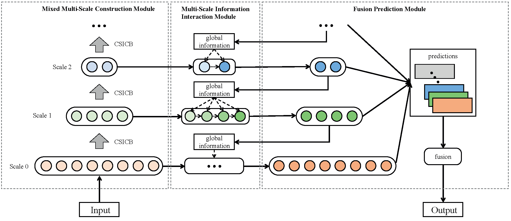
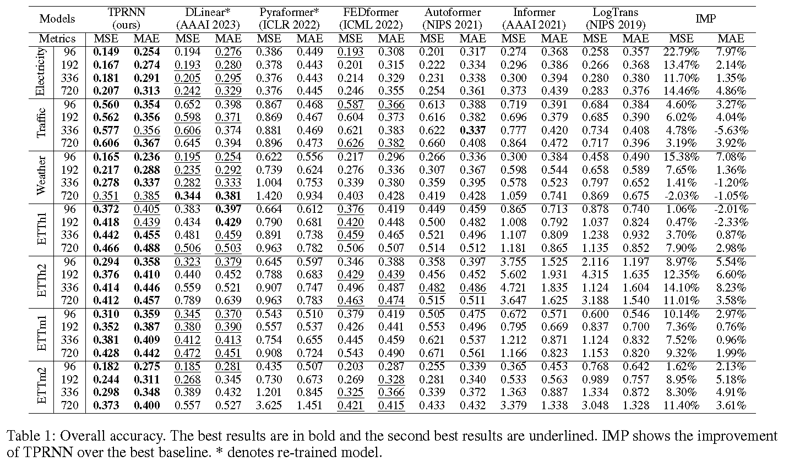

# TPRNN
This repo is the official implementation for Top-Down Pyramidal Recurrent Neural Network (TPRNN) for Multivariate Time Series Forecasting.
## Overview

## Requirements
To install requirements:
```
pip install -r requirements.txt
```
## Training
```
\# elect
python exp_start.py --model TPRNN --data_loader_type custom --data elect --input_len 96 --output_len 96 --features M
\# traffic
python exp_start.py --model TPRNN --data_loader_type custom --data traffic --input_len 96 --output_len 96 --features M
\# weather
python exp_start.py --model TPRNN --data_loader_type custom --data weather --input_len 96 --output_len 96 --features M
\# ETTh1
python exp_start.py --model TPRNN --data_loader_type ETTh1 --data ETTh1 --input_len 96 --output_len 96 --features M
\# ETTh2
python exp_start.py --model TPRNN --data_loader_type ETTh2 --data ETTh2 --input_len 96 --output_len 96 --features M
\# ETTm1
python exp_start.py --model TPRNN --data_loader_type ETTm1 --data ETTm1 --input_len 96 --output_len 96 --features M
\# ETTm2
python exp_start.py --model TPRNN --data_loader_type ETTm2 --data ETTm2 --input_len 96 --output_len 96 --features M
```
## Main Results

